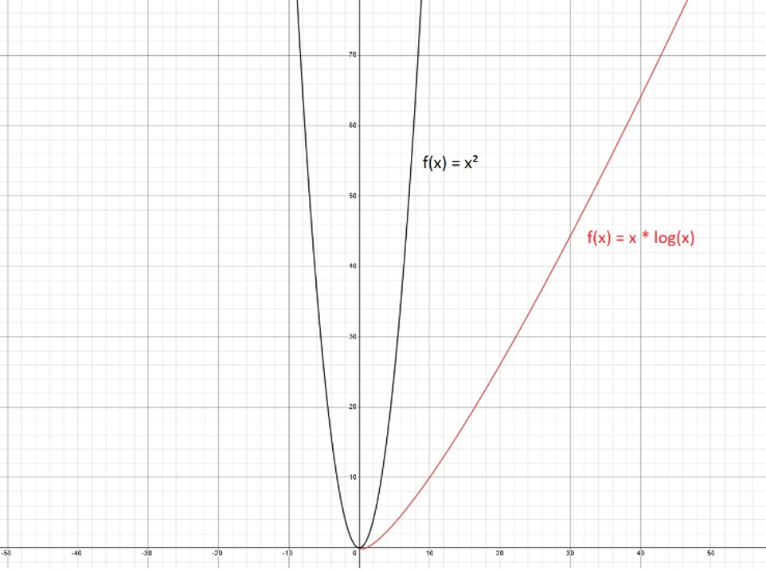

# sorting-algorithms-benchmark
Experiment and analysis of sorting algorithms performance in Java.

## 1. **Especificações do sistema**
  ### 1.1. **Hardware**
    Processador		Intel(R) Core(TM) i3-9100F CPU @ 3.60GHz   3.60 GHz
    
    Memória RAM		8,00 GB
    
    Sistema			Windows 64-bit, x64-based processor
      
  ### 1.2 **Ambiente**
    Java 20
    
    Intellij IDEA 2023.2.1
    
    JDK 20

## 2. **Relatório de execução**

Foram utilizados os algoritmos de ordenação *Bubblesort* — complexidade média O(n²) — e *Mergesort* — complexidade média O(n\*log(n)). A implementação em Java de ambos algoritmos utilizados neste trabalho é de autoria do projeto “The Algorithms”, repositório de código aberto disponível em <https://github.com/TheAlgorithms/Java/>. 

Para cada tamanho de vetor, foram realizadas 50 diferentes execuções, calculando-se, posteriormente, a média do tempo gasto entre tais execuções. Para metrificação de tempo, foi utilizada a função Java.lang.System.nanoTime( ).

  ## 2.1. **Bubblesort**
  ### 2.1.1. **Tempos de execução**
  
  |||**Tempo médio de execução**||
  | :-: | :-: | :-: | :- |
  |**Execução**|**Tamanho do vetor**|**Em nanossegundos (ns)**|**Em segundos (s)**|
  |#1|62500 elementos|12068741552|12,068|
  |#2|125000 elementos|17931194540|17,931|
  |#3|250000 elementos|320133317300|320,133|
  |#4|375000 elementos|737067247850|737,067|
  
  **Obs.:** Em função do elevado tempo de execução necessário para ordenar vetores de tamanho 375000, foi necessário, visando a praticidade do cálculo da média de tempo desejada, reduzir a amostra realizada na execução #4, antes de 50 instâncias, para apenas 15 instâncias de vetores ordenados.
  
  ### 2.1.2. **Análise**
  
  Considerando que o conteúdo dos vetores foi aleatoriamente gerado e que a possibilidade de ocorrência de eventos é igual para todas as posições do vetor, é pertinente realizar a análise dos tempos de execução em relação ao caso médio do Bubblesort, cuja complexidade é de O(n²).
  
  A partir dos resultados registrados, é possível observar que:
  
  - Entre as execuções #1 e #2, houve aumento 2,00x no tamanho da entrada e de 0,67x no tempo de execução.
  - Entre as execuções #1 e #3, houve aumento de 4,00x no tamanho da entrada e de 26,52x de no tempo de execução.
  - Entre as execuções #1 e #4, houve aumento de 6,00x no tamanho da entrada e de 61,07x no tempo de execução.
  
  Visto que a máquina em que foi realizada a experimentação executa, em média, 3.6B de instruções por segundo (3600000000/s) em função do clock de seu processador, é possível estimar a quantidade de operações realizadas e o tempo de execução para cada entrada e, por conseguinte, comparar com os resultados observados: 
  
  |**Entrada**|**Qtd. estimada de operações (n²)**|<b>Tempo estimado (n²/3.6*109)</b>|**Tempo observado**|
  | :-: | :-: | :-: | :-: |
  |65000|4225000000|1,173|12,068|
  |125000|15625000000|4,340|17,931|
  |250000|62500000000|17,361|320,133|
  |375000|140625000000|39,062|737,067|
  
  Apesar da discrepância entre os valores de tempo estimado e tempo observado, é notório que **a ordem de crescimento** dos valores em função do tamanho da entrada progride de maneira semelhante em ambos, correspondendo corretamente à complexidade O(n²).
  
  A divergência de valores entre o tempo estimado e o tempo observado pode ser explicada pelo fato de que não é possível determinar especificamente, para os processos envolvidos na execução do experimento, a exata performance de processamento, ou seja, a quantidade de instruções por segundo, quando foi executado o programa. Ademais, a noção dessa performance se faz ainda mais nebulosa ao se considerar que, paralelamente, inúmeros outros processos estavam sendo executados na máquina.

## 2.2. **Mergesort**
  ### 2.2.1. **Tempos de execução**
  
  |**Execução**||**Tempo médio de execução**||
  | :-: | :-: | :-: | :- |
  ||**Tamanho do vetor**|**Em nanossegundos (ns)**|**Em segundos (s)**|
  |#1|62500|12000532|0,012|
  |#2|125000|23327588|0,023|
  |#3|250000|70143638|0,070|
  |#4|375000|99917472|0,099|
  
  ### 2.2.2. **Análise**
  
  Assim como na análise do algoritmo Bubblesort, cabe, na análise dos resultados obtidos com o Mergesort, considerar o caso médio como referência para comparação — cuja complexidade é O(n\*log(n)).
  
  A partir dos resultados registrados, é possível observar que:
  
  - Entre as execuções #1 e #2, houve aumento 2,00x no tamanho da entrada e de 1,94x no tempo de execução.
  - Entre as execuções #1 e #3, houve aumento de 4,00x no tamanho da entrada e de 5,84x de no tempo de execução.
  - Entre as execuções #1 e #4, houve aumento de 6,00x no tamanho da entrada e de 8,32x no tempo de execução.
  
  Dessa forma, tendo em vista a análise anterior, pode-se constatar que o crescimento do tempo de execução à medida que se acresce o tamanho da entrada é muito mais sutil com o Mergesort do que com o Bubblesort.
  
  Abaixo encontra-se a estimativa de operações e tempo de execução realizados na máquina, possibilitando a comparação entre os valores esperados e os valores observados.
  
  |**Entrada**|**Qtd. estimada de operações (n\*log(n))**|<b>Tempo estimado (n* log(n)/3.6*109)</b>|**Tempo observado**|
  | :-: | :-: | :-: | :-: |
  |65000|1039229|0\.0002|0,012|
  |125000|2116446|0,0005|0,023|
  |250000|4482892|0,0012|0,070|
  |375000|6943699|0,0019|0,099|
  
  Visualizando as funções 	f(x)= x\*log2(x)	e	f(x) = x² 	no gráfico, é possível perceber como a curva de crescimento de algoritmos de complexidade O(n\*log(n)) — como o Mergesort — é evidentemente menos acentuada em relação à de algoritmos O(n²), como o Bubblesort.

  
 
  A partir dos resultados de experimentação e análises realizadas, pode-se comprovar, pois, que, no contexto de caso médio de execução, o Mergesort é mais eficiente que o Bubblesort para ordernar vetores. 

## 2.3. **Quicksort**
  ### Tempo médio de execução
  
  |**Vetor não ordenado**|**Vetor previamente ordenado**|
  | :-: | :-: |
  |5386840|7049570|
  
  Os resultados observados durante a experimentação confirmam o comportamento teórico esperado do Quicksort, cuja eficiência pode ser afetada negativamente quando se o aplica a vetores já ordenados. Segundo Cormen et al. (2012), isso se dá em função do desbalanceamento do processo de partição do vetor, e tal contexto de execução pode levar a complexidades O(n²)
  
  > *“Moreover, the O(n²) running time occurs when the input array is already completely sorted — a common situation in which insertion sort runs in O(n²) time*” (Cormen et al., 2012)
